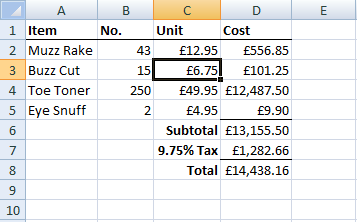
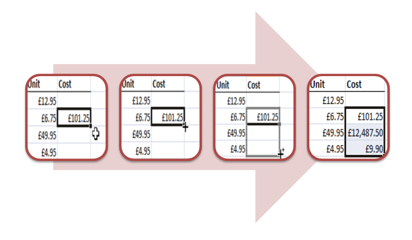

# (PART) Introduction to Quantitative Reasoning {-}

# Use of Technology

## Spreadsheets

Key Skills:

- q1 Be able to use a standard calculator (scientific or graphical). 
- q2 Be able to read information from a standard spreadsheet.
- q3 Be able to enter formulae and data into a spreadsheet, knowing that a standard spreadsheet formula starts with "=".
- q4 Be able to interpret simple formulae on a spreadsheet given in terms of cell references.
- q5 Be able to copy a formula and to ensure that only the required cell addresses increment.
- q6 Be able to use a spreadsheet to find a numerical solution of an equation.
- q7 Be able to use a spreadsheet to draw graphs and standard statistical diagrams and interpret graphs produced on spreadsheets.

This chapter is designed to be  aready reference of the various calculator/spreadsheet tools you may need throughout the course. Feel free to skip it unless you love spreadsheets as much as I do!

### Basic Orientation

Common spreadsheet programs are [Microsoft Excel](https://office.live.com/start/Excel.aspx), [Apache Open Office Calc](https://www.openoffice.org/) and [Google Sheets](https://www.google.com/sheets/about/). They all use the same basic concepts and have the same or very similar ways of working. You are free to use any spreadsheet software you like.

The simple genius of the spreadsheet is that it is a giant grid into which you can put information, this might be labels, numbers, percentages, financial data or any other type of data you can think of. Sounds boring but once your data is in that grid you can then get the computer to do the analysis and calculations you want it to. If your data changes you just change the cell and all the other cells that depend on it update automatically. Spreadsheets were initially developed for the commercial world [(e.g. VisiCalc developed by Dan Bricklin and Bob Frankston whilst at Harvard Business School in 1978)](http://news.harvard.edu/gazette/story/2012/03/a-vision-of-the-computing-future/), today they find use in a wide variety of business and technical applications - being able to use them is essential.

You refer to the grid by cell references. These consist of a letter and a number, the letter tells you which column you want and the number which row. For example: the highlighted cell in \@ref(fig:sample-spreadsheet) is cell `C3`. Once numbers are in cells you can start playing with them! That lovely total cost of 15 Buzz Cuts in cell `D3` is calculated with a formula that multiplies 15 by £6.75. The formula is `=B3*C3`. 

Why use a formula when you could just work out the values on a calculator and type them in? Or why use cell references when you could just type in `=15*6.75`? Using the formula presents two massive advantages, the first one is that if, say, the price of a Buzz Cut changes next month or we manage to sell more than 15 of them it is really easy just to change the values in the cells `B3` or `C3` and the calculated value in `D3` will automatically update itself! The second is that if we are careful we only have to type a formula in once and our spreadsheet can work out how to apply it to a range of cells.

```{r sample-spreadsheet, echo = FALSE, fig.cap = 'A Sample Spreadsheet.'}

```

### Auto Filling Formulae

An experienced spreadsheet user will only type in a formula once and then use the auto fill feature to create similar formulae in other cells. For example say we had entered `=B3*C3` in cell `D3` as above. We did this to multiply the number sold by the unit price. We can now "translate" that formula down to a lower cell, we don't want an exact copy but we do want a formula to calculate the product of the two numbers immediately to the left.

The steps to acheiving this are:

- select the cell you want to translate,
- hover the mouse over the bottom right hand corner until it changes,
- left click the mouse and drag the formula either up or down as needed,
- *Voila*! Your your formula has been adapted and copied down automatically.

See if you can create a similar spreadsheet and auto fill the product formula yourself.

```{r autofill, echo = FALSE, fig.cap = 'How to Auto Fill a Formula.'}

```

### Operations and Simple Functions

The number of spreadsheet functions that you are expected to know are quite small. In this chapter we will cover all of the functions that you *must* know according to the syllabus as well as a few other functions that you may find useful.

#### The four operations

The four basic operations are:

- `+` for addition,
- `-` for subtraction,
- `*` for multiplication,
- `/` for division.

So to calculate $5+3$ I enter `=5+3`. Notice how every formula begins with the `=` sign, that is really important and a common mistake in exams. For $7-4$ I enter `=7-4`. For $3\times5$ I enter `=3*5` and for $56 \divide 8% I enter `=56/8`.

More complicated calculations can be entered using brackets under the usual rules of the order of operations.

So I can calculate:

$$\frac{5\times7 + 3 \times (7-2)}{(8+6)\times5}$$

by entering:

`=(5*7+3*(7-2))/((8+6)*5)`.

It might look a little intimidating at first especially if you replace those numbers with cell references, just remember that if you need to you can calculate different parts of your expression in different cells and then bring them all together at the end. For example I could put `=(5*7+3*(7-2))` in cell `A1` and then `=((8+6)*5)` in cell `A2` and finally enter `=A1/A2` in cell `A3` for my final answer.

#### Powers and roots

If I want to raise one number to the power of another I use the `^` operator. The number on the left is the base and the number on the right is the power. So I can calculate $5^3$ by entering `=5^3` instead of the more cumbersome but equivalent `=5*5*5`.

Spreadsheets provides a function for square rooting called `SQRT()`. To calculate $\sqrt{64}$ simply enter `=SQRT(64)`. If I need to work out the square root of a number in cell `A3` I would type in `=SQRT(A3)`.

Often in financial maths we will need to take what is called the "nth root" and most spreadsheets don't have a dedicated function for acheiving this.Lets say I wanted to take the 15th root of the number 2 (something I might do if I wanted to calculate the average annual percentage increase over 15 years that results in doubling my money).

On your calculator you have  a dedicated nth root button but in a spreadsheet you need to use the fact that

$$\sqrt[n]{x}=x^{\frac{1}{n}}$$.

So to calculate $\sqrt[15]{2}$ I enter `=2^(1/15)`. Notice that the portion after the `^` is "one over" the root I wish to find and that it is in brackets, the brackets are *essential* to make this work.